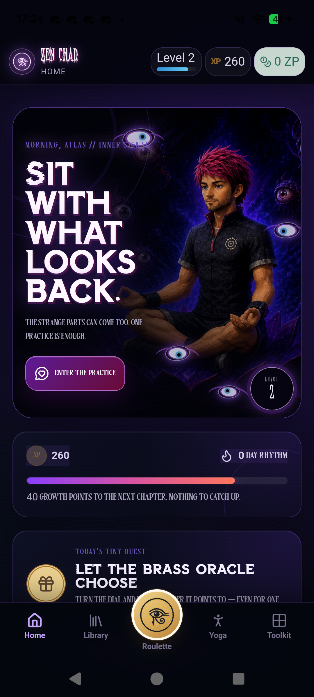
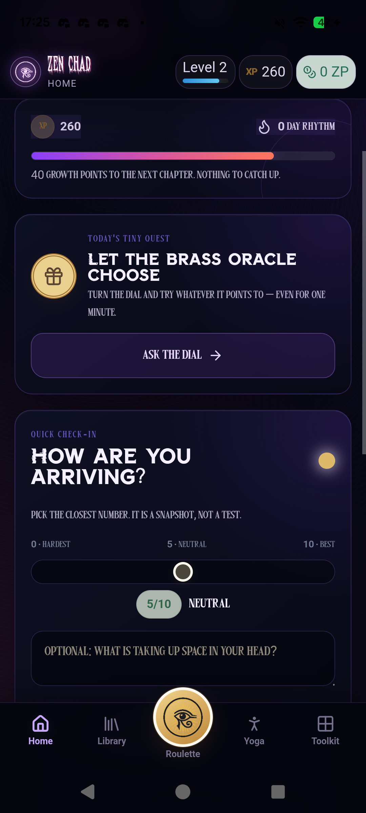
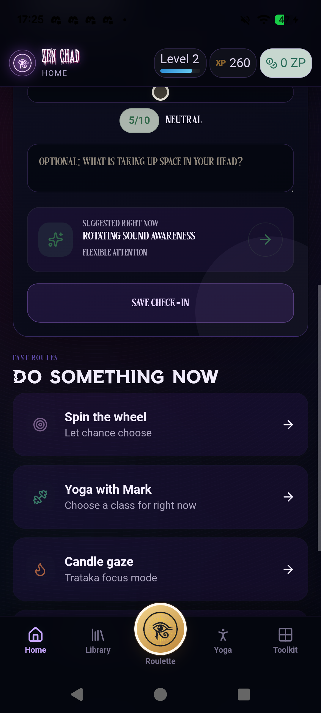
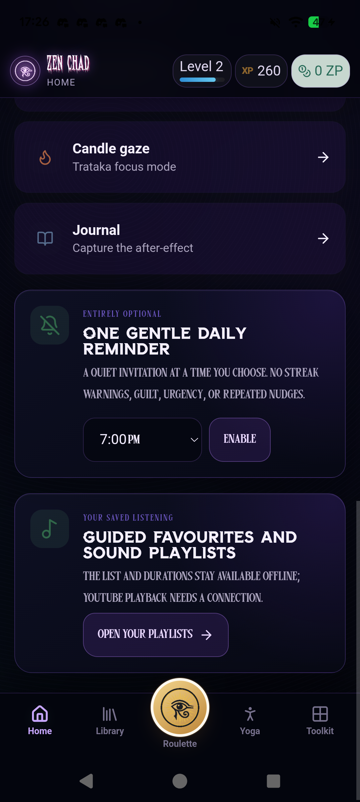
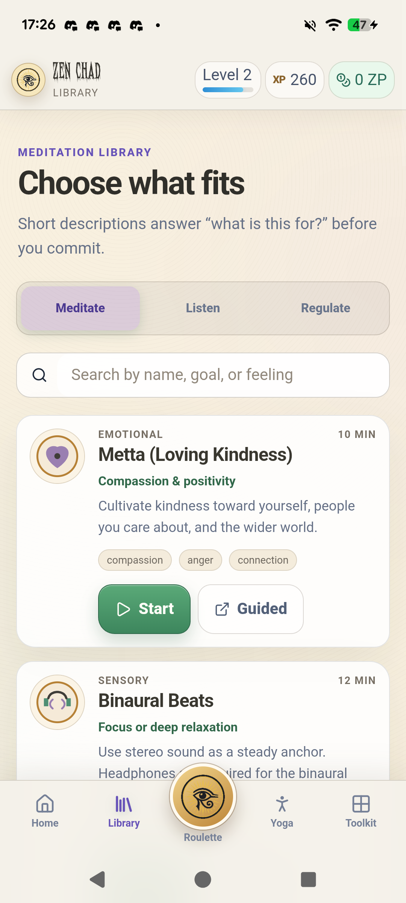
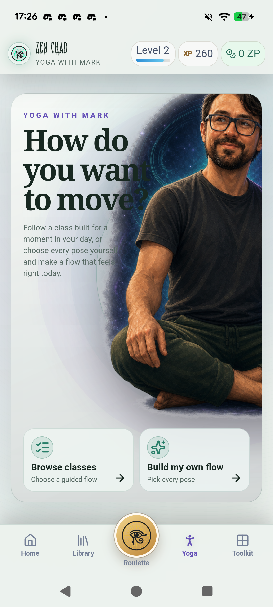
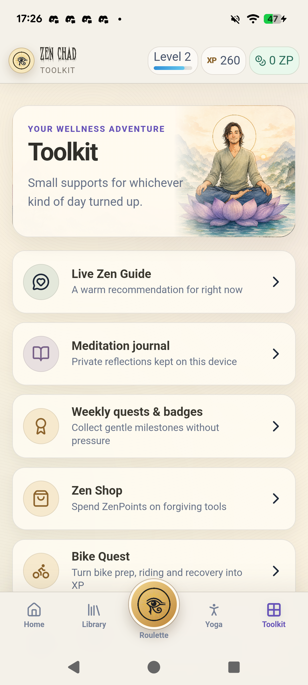
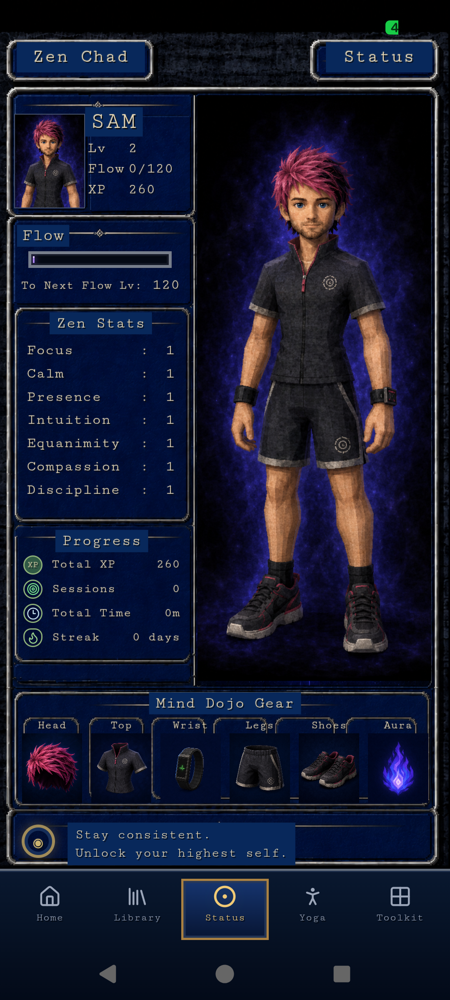
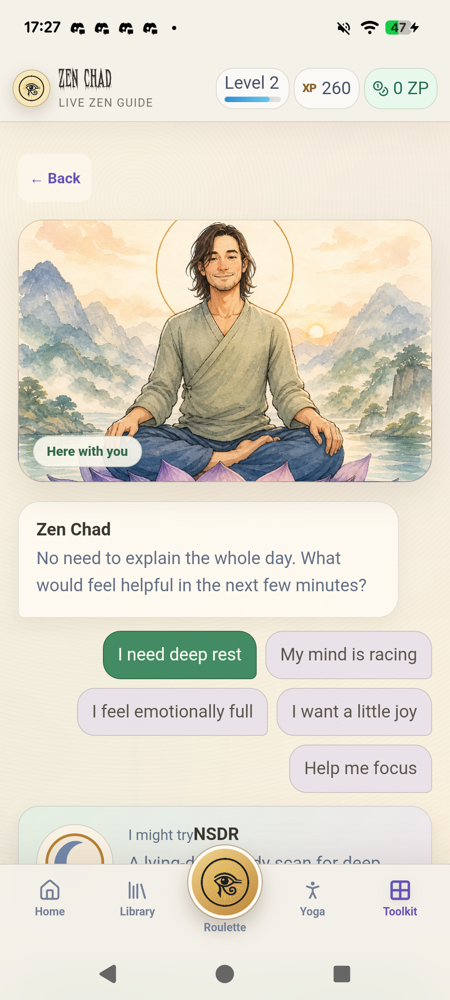

# ZenChad home screen audit and redesign direction

Date: 2026-08-19  
Surface: Android app 1.7 on Pixel 6a, checked against the current `ZenChadAndroid` source tree  
Goal: make Home a clear, enjoyable daily starting point instead of a second menu for the whole app

## What the product currently contains

ZenChad has five main product families:

- Practice: Meditation Library, meditation timers, guided audio, Live Zen Guide, Roulette, and Soundscapes.
- Movement: Yoga with Mark, Bike Quest, Quick Runs, Story Runs, and run history/progression.
- Reflection and regulation: Meditation Journal, offline voice journaling, mood records, and the Emotional Toolbox.
- Progress and rewards: Status, XP, Flow/Zen Stats, ZenPoints, quests, badges, cosmetics, and the Zen Shop.
- Personalisation and support: themes, reminders, motion/audio preferences, and other settings.

The five-item bottom navigation already supplies the stable top-level map: Home, Library, Roulette, Yoga, and Toolkit. Status is reached through the progress HUD. This means Home does not also need to be a directory for all of those destinations.

## Evidence captured

### Step 1 — Home arrival: needs restructuring

The character art is distinctive and memorable. The large overlay title, eyebrow, paragraph, decorative eyes, level seal, and button all compete within the same picture. The text crosses detailed artwork and has inconsistent contrast. The page then repeats XP and level information immediately below the identical information in the top bar.

### Step 2 — Quest and check-in: overloaded

The Roulette is already the permanent, oversized centre action in the bottom navigation. “Let the brass oracle choose,” “Ask the dial,” and the later “Spin the wheel” route all repeat that action. The mood check-in is a full form with eleven states, a slider, optional writing, a generated recommendation, a start button, and a save action. It becomes a task before the user reaches the app’s actual activities.

### Step 3 — Fast routes: duplicated navigation

The fast routes repeat Roulette and Yoga from the bottom navigation, while Journal and Candle Gaze already have clear homes in Toolkit and Library. This section does not learn from recency, favourites, an unfinished session, or the user’s current context.

### Step 4 — Settings and Library promotion: misplaced

Reminder configuration belongs in Settings, and saved listening belongs in Library. Giving both large promotional cards on Home makes the page feel like an onboarding page that never ends. The current source has already removed the reminder card, but it is still present in the installed 1.7 build shown here.

### Step 5 — Library: generally healthy

Library has a clear job: find a practice. Search, category tabs, benefits, duration, tags, and start actions are useful here. Home should point to Library only when the user wants to browse; it should not reproduce Library content as promotions.

### Step 6 — Yoga: healthy structure, distinct art direction

Yoga succeeds because it begins with one question and offers two paths: browse or build. The large illustration remains readable because most copy sits over a calm, protected part of the composition. This is a good structural model for Home.

### Step 7 — Toolkit: healthy ownership, long catalogue

Toolkit correctly owns utilities and secondary journeys. Its list is long, but the labels and descriptions are clear. Home should stop duplicating Journal, Guide, quests, movement tools, themes, reminders, and saved listening, because those items already have stable homes.

### Step 8 — Status: useful but visually disconnected

Status already owns XP, level, Flow, Zen Stats, session counts, streaks, and equipment. The small Home progress card therefore adds repetition rather than orientation. Status can remain a special “game room,” but the shell, navigation, type scale, and core controls should still feel related to the rest of ZenChad.

### Step 9 — Live Zen Guide: overlaps with the Home check-in

The Guide already asks what the user needs and turns that choice into a recommendation. The Home mood form attempts the same job with a more clinical and time-consuming interaction. ZenChad should have one obvious “help me choose” path rather than two competing recommendation systems.

## Overall verdict

The Home screen is visually memorable but structurally unfocused. It currently performs six jobs:

1. Brand poster
2. Practice recommender
3. Progress dashboard
4. Roulette promotion
5. Mood journal
6. Directory and settings promotion

That is why it feels like a hodgepodge even though many individual cards are competently made. The issue is ownership and hierarchy before it is spacing or polish.

## Recommended direction: “Today in the dojo”

Home should answer one question: **What is the most useful next thing I can do?**

The redesigned screen should fit its essential content within roughly one to one-and-a-half phone viewports.

| Position | Section | What it does |
| --- | --- | --- |
| Fixed header | Greeting, compact avatar, level ring | Provides identity and one path to Status. XP and ZP can sit behind that tap or in one compact balance pill; do not repeat a full progress card below. |
| Primary card | “What would help right now?” | Uses the good character art, but reserves a calm image area and a separate solid copy area. It presents one recommended or resumable action with duration and reason. |
| Three immediate paths | Sit, Move, Listen | Reduces the whole product to three human choices. Sit opens the recommendation/Library, Move offers Yoga/Run/Bike, and Listen opens saved audio or Soundscapes. Roulette remains exclusively in the permanent centre button. |
| Compact rhythm strip | This week, last practice, streak | One tappable row leading to Status. It acknowledges progress without turning Home into a stats dashboard. |
| Recent or saved | Continue / Do again | Shows at most two context-aware items: an unfinished journey, last-used practice, or favourite. Hide the section when there is no meaningful history. |
| Collapsed secondary area | “Reflect & plan” | A single accordion for optional mood note, Journal, and reminder settings. Closed by default. It never blocks the primary action. |

### Suggested first-screen copy

- Greeting: “Evening, Sam.”
- Prompt: “What would help right now?”
- Recommendation: “Ten quiet minutes” / “NSDR · 10 min” / “Good for deep rest.”
- Primary action: “Start NSDR”
- Secondary link: “Choose something else”
- Progress: “This week · 2 practices · 24 min”
- Reassurance after a completed session: “You’ve done enough today. Anything else is a bonus.”

## What to keep, move, merge, and remove

| Current element | Decision | New home |
| --- | --- | --- |
| Character artwork | Keep | Use as a quieter, better-cropped hero image with a protected text panel. No important copy over the face or high-detail areas. |
| “Enter the practice” | Replace | Use a specific action such as “Start NSDR,” “Continue your run,” or “Choose a practice.” |
| Level, XP, and streak card | Remove | Keep one compact status entry in the header and let Status own details. |
| “Let the brass oracle choose” | Remove | Roulette already has the permanent central navigation button. |
| Full “How are you arriving?” form | Move and simplify | Put an optional short check-in inside “Reflect & plan,” or let the Live Zen Guide be the single recommender. Do not show both. |
| “Spin the wheel” fast route | Remove | Permanent Roulette button owns it. |
| “Yoga with Mark” fast route | Remove as a generic shortcut | Yoga already has a permanent tab. Show it on Home only when it is a recent, suggested, or resumable activity. |
| Candle Gaze and Journal routes | Contextual only | Surface only as recommendations or recent actions; otherwise Library and Toolkit own them. |
| Reminder configuration | Move | Settings only. A one-time setup prompt is acceptable, but not a permanent Home card. |
| Saved listening promotion | Remove | Library owns saved listening. Home may show the last-played item only. |

## Consistency rules for the whole app

ZenChad can keep different “rooms” without looking like several unrelated apps. The shell should remain stable while the artwork changes.

- Use one legible sans-serif for all body copy, buttons, navigation, and data.
- Use one personality display face only for short headings or the ZenChad wordmark. Do not use condensed novelty faces for instructions or paragraphs.
- Keep the same header height, bottom navigation, card radius, spacing scale, button height, and icon treatment across Home, Library, Yoga, Toolkit, and Status.
- Let light/dark/auto appearance apply to Home. Do not force Home into a horror-dark theme while the next screen becomes warm parchment.
- Treat cosmic purple, watercolour cream/sage, and antique gold as one palette hierarchy: purple for identity, green for primary action, gold for rewards. Avoid making every section invent its own colour language.
- Status may retain its JRPG personality, but should reuse the shared navigation labels, readable body type, safe-area spacing, and control shapes.
- Stop randomising the brand wordmark on each launch. Choose one readable primary logo; alternate treatments can be unlockable themes or rare easter eggs.

## Context-aware Home states

The layout stays fixed, but the primary card changes meaningfully:

- First visit: “Choose your first practice” with Sit, Move, and Listen.
- Returning with no active task: repeat the last successful practice or show one time/context-aware suggestion.
- Unfinished Yoga, Bike Quest, Run, or meditation: “Continue where you left off” becomes the only primary action.
- A session completed today: replace pressure with “You’ve done enough today,” then offer one optional recent/favourite item.
- New reward or level: show a small dismissible status chip, not a permanent large card.

## Accessibility risks visible in the captures

- Text is placed over detailed moving artwork on Home, so contrast changes with the image and animation frame.
- Several Home labels use small, condensed, all-caps type that is difficult to scan.
- Purple-grey secondary text on near-black cards appears low contrast in places.
- The oversized centre Roulette button visually overlaps page content and reduces the apparent safe area above the bottom navigation.
- The full Home check-in creates a long reading and interaction order before users reach actual activities.

Strengths include large touch targets, explicit reduced-motion handling in the current source, descriptive button labels in several core screens, and generally clear cards in Library, Yoga, and Toolkit. Screenshots cannot confirm screen-reader announcements, semantic heading order, keyboard focus, focus visibility, or behaviour at 200% text/zoom; those need a separate implementation QA pass.

## Implementation plan

### Phase 1 — Information architecture and Home cleanup

- Remove Home duplicates: progress card, Roulette quest, generic fast routes, reminder setup, and playlist promotion.
- Choose one recommendation owner: the Live Zen Guide or a simplified Home choice flow.
- Build the fixed six-part Home structure described above using existing routes and data.
- Keep all persistence and activity flows unchanged.

### Phase 2 — Shared visual system

- Make Home respect the selected appearance mode.
- Establish the two-font rule and shared header/card/button/navigation tokens.
- Re-crop the existing hero art and place copy in a protected panel.
- Bring Status navigation and functional text back into the shared shell while keeping the JRPG content treatment.

### Phase 3 — Useful personalisation

- Add a lightweight recent/resume model for meditation, Yoga, Bike Quest, and Running.
- Make the primary card respond to unfinished work, last activity, time of day, and completed-today state.
- Keep recommendations deterministic and explain them in one short line.

### Phase 4 — Android QA

- Check 412 × 915 CSS pixels, Pixel 6a device size, 1.0 and 1.3 font scales, light/dark/auto, and reduced motion.
- Verify that the first primary action, all three paths, Status, and the accordion are reachable and readable without content hiding behind the bottom navigation.
- Test TalkBack labels and order separately; screenshot review alone is not enough.

## Acceptance criteria

- No Home action duplicates a permanent bottom-navigation destination unless it is personalised by recency, resume state, or a recommendation.
- The first viewport contains one clear primary action and no more than three secondary paths.
- Important text never overlaps a face or visually busy artwork.
- Home respects the chosen appearance mode and uses the same functional typography as the rest of the app.
- Progress details, reminders, saved listening, and the full utility catalogue each have one clear owner.
- A user can understand the next useful action within a few seconds without scrolling.
